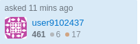
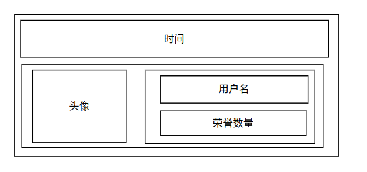

## 模拟StackOverFlow的名片

为了巩固css知识，我们模仿StackOverFlow网站的名片样式，网站图如下：

1、确定整体结构

 

## 下载Bootstrap

Bootstrap是一个流行的、开源的包，里面有许多设计好的样式。
我们一般使用bootstrap.min.css样式库，该库是一个常用的css库，因此一般引用bootstrap.min.css和bootstrap.min.js即可。